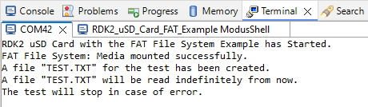
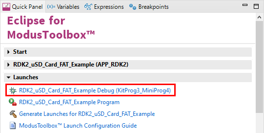

# RDK2 uSD Card FAT Example

Rutronik Development Kit Programmable System-on-Chip CY8C6245AZI-S3D72 "uSD Card with FAT file system" Example. 

This example demonstrates how to access uSD card using FAT file system.

 

### Using the code example with a ModusToolbox IDE:

1. Import the project: **File** > **Import...** > **General** > **Existing Projects into Workspace** > **Next**.
2. Select the directory where **"RDK2_uSD_Card_FAT"** resides and click  **Finish**.
3. Select and build the project **Project ** > **Build Project**.

### Operation

The program initiates the uSD hardware and FAT file system. Tries to mount the uSD card and if succeeds creates a test file, then opens and reads it indefinitely to make sure no errors ever occur.  

### Debugging

If you successfully have imported the example, the debug configurations are already prepared to use with a the KitProg3, MiniProg4, or J-link. Open the ModusToolbox perspective and find the Quick Panel. Click on the desired debug launch configuration and wait until the programming completes and debugging starts.

## Legal Disclaimer

The evaluation board including the software is for testing purposes only and, because it has limited functions and limited resilience, is not suitable for permanent use under real conditions. If the evaluation board is nevertheless used under real conditions, this is done at one’s responsibility; any liability of Rutronik is insofar excluded. 

